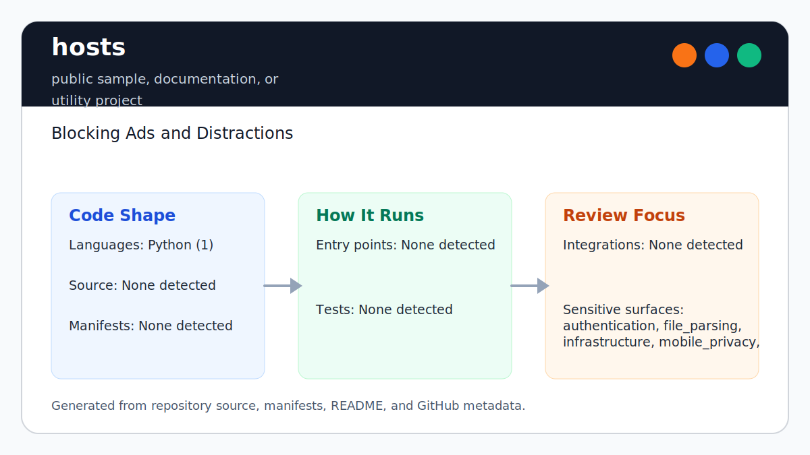

# hosts

<!-- README-OVERVIEW-IMAGE -->


## Overview

`garethpaul/hosts` is a public sample, documentation, or utility project. Blocking Ads and Distractions

This README is based on the checked-in source, manifests, scripts, and repository metadata on the `master` branch. The project language mix found during review was: Python (1).

## Repository Contents

- `CHANGES.md` - concise history of maintenance changes
- `.github/workflows/check.yml` - CI baseline that runs the static Make gate
- `Makefile` - local verification entry point
- `README.md` - project overview and local usage notes
- `SECURITY.md` - security reporting and disclosure guidance
- `VISION.md` - project direction and maintenance guardrails
- `hosts` - generated hosts-file blocklist snapshot
- `readmeData.json` - source and variant metadata produced by the updater
- `scripts/check-baseline.py` - static hosts-file and updater verifier
- `updateFile.py` - legacy hosts aggregation/update tooling

Additional scan context:

- Source directories: no top-level source directories detected
- Dependency and build manifests: readmeData.json
- Entry points or build surfaces: `make check`, `python3 updateFile.py --help`
- Test-looking files: no obvious test files detected

## Getting Started

### Prerequisites

- Git
- Python 3 for local static verification
- Python 2.7 or Python 3 for the legacy updater, depending on the environment being revived

### Setup

```bash
git clone https://github.com/garethpaul/hosts.git
cd hosts
make lint
make test
make build
make check
```

The checked-in `hosts` file is a generated snapshot. The updater references source and extension folders that are not present in this snapshot, so `make check` validates the current artifact without fetching or regenerating source data.

## Running or Using the Project

- Read or consume the checked-in `hosts` file as the generated blocklist artifact.
- Run `python3 updateFile.py --help` to inspect legacy update options.
- Custom exclusions must be plain domains, and they are escaped before regex
  compilation so domain dots are matched literally. Custom exclusions are
  normalized to lowercase before matching generated hosts entries.
- Output subfolders must be relative paths without parent traversal, so
  generated hosts files stay inside the repository tree.
- Do not run replacement actions against `/etc/hosts` unless you understand the local impact and have a rollback copy.

## Testing and Verification

Run the static baseline:

```bash
make lint
make test
make build
make check
```

The `lint`, `test`, and `build` targets intentionally alias the static baseline
so the standard local gate commands stay available while preserving the single
source of truth.

The baseline runs `scripts/check-baseline.py`, validates `readmeData.json`, parses the README SVG, checks `updateFile.py` syntax without fetching remote lists, verifies generated hosts-line syntax and counts, and limits duplicates to known static localhost aliases.
It also verifies updater source fetches keep HTTP(S)-only URL validation,
source URL host validation, HTTPS source URLs, network timeouts, and response cleanup behavior.
Source metadata file handles are also checked so JSON reads close promptly while
building source data. Source output file handles are checked so generated hosts
files close even when source writes fail.
Output subfolders are checked so updater writes cannot target paths outside the
repository through absolute paths or parent traversal.
GitHub Actions runs the same no-network `make check` gate through
`.github/workflows/check.yml` on pushes and pull requests.

When the required SDK or runtime is unavailable, use static checks and source review first, then verify on a machine that has the matching platform toolchain.

## Configuration and Secrets

- No required secret or credential file was identified in the repository scan. If you add integrations later, keep secrets out of git.

## Security and Privacy Notes

- Review changes touching authentication or token handling; examples from the scan include updateFile.py.
- Review changes touching network requests, sockets, or service endpoints; examples from the scan include readmeData.json, updateFile.py.
- Review changes touching file, media, JSON, XML, CSV, OCR, or data parsing; examples from the scan include updateFile.py.
- Review changes touching shell execution, subprocess, or dynamic evaluation; examples from the scan include updateFile.py.
- Review changes touching infrastructure, proxy, cloud, or deployment configuration; examples from the scan include readmeData.json.
- Treat false positives as security and reliability issues: an overbroad entry can block account recovery, updates, payments, or other important services.
- Source URLs require HTTPS schemes and hosts before the updater fetches them.
- Output subfolders must stay inside the repository before generated hosts data
  is written.
- `updateFile.py --replace` and DNS flush behavior can affect the local machine's `/etc/hosts`; review generated output and keep backups before privileged replacement.

## Maintenance Notes

- See `SECURITY.md` for vulnerability reporting and safe research guidance.
- See `VISION.md` for project direction and contribution guardrails.
- See `docs/plans/2026-06-08-exclusion-domain-validation.md` for the custom exclusion input guardrail.
- See `docs/plans/2026-06-09-exclusion-domain-case-normalization.md` for the
  custom exclusion lowercase normalization guardrail.
- See `docs/plans/2026-06-09-source-fetch-response-cleanup.md` for the updater source fetch cleanup guardrail.
- See `docs/plans/2026-06-09-source-data-file-handle-cleanup.md` for the
  source metadata file-handle cleanup guardrail.
- See `docs/plans/2026-06-09-source-url-host-validation.md` for the source URL
  host validation guardrail.
- See `docs/plans/2026-06-09-source-output-file-handle-cleanup.md` for the
  source output file-handle cleanup guardrail.
- See `docs/plans/2026-06-09-output-subfolder-validation.md` for the updater
  output subfolders guardrail.
- See `docs/plans/2026-06-10-source-url-https.md` for the HTTPS source URL
  baseline.
- See `docs/plans/2026-06-10-ci-baseline.md` for the lightweight CI baseline.
- See `docs/plans/2026-06-09-make-gate-aliases.md` for the local gate alias guardrail.
- Run `make lint`, `make test`, `make build`, and `make check` before pushing changes to `hosts`, `readmeData.json`, updater code, or source metadata.

## Contributing

Keep changes small and tied to the project that is already present in this repository. For code changes, document the toolchain used, avoid committing generated dependency directories or local configuration, and update this README when setup or verification steps change.
